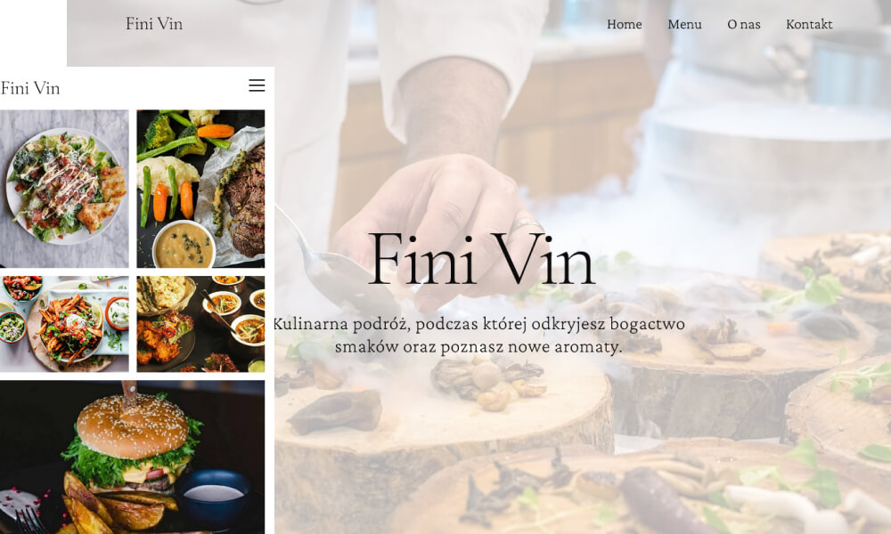

## FiniVin
### Restaurant website template

HTML5 / CSS3 / TAILWIND

Website template for a restaurant, using a serif font. Multipage website with Lightbox with a photo gallery and Testimonial with opinions. There is also a contact form that will send a message to your email.

:poland:
Szablon strony dla restauracji, z użyciem czcionki szerofywej. Strona typu multipage na której zamieszczony jest Lightbox z galerią zdjęć oraz Testimonial z opiniami. Znajdziemy tu również formularz kontaktowy, który wyśle wiadomość na Twojego emaila.

## :star2: [Demo](https://damiankoduje.pl/templates/finivin/index.html)

**Framework CSS:**
- [Tailwind](https://tailwindcss.com)

**Photos:**
- [Pexels](https://www.pexels.com)

**Fonts:**
- [Crimson  Pro](https://fonts.google.com/specimen/Crimson+Pro)
- [Cormorant Garamond](https://fonts.google.com/specimen/Cormorant+Garamond)
- [Inter](https://fonts.google.com/specimen/Inter)

**JavaScript:**
- [AOS](https://michalsnik.github.io/aos)
- [GLightbox](https://biati-digital.github.io/glightbox)
- [Swiper](https://swiperjs.com)

### :slightly_smiling_face: Template created by [Damiankoduje.pl](https://damiankoduje.pl)