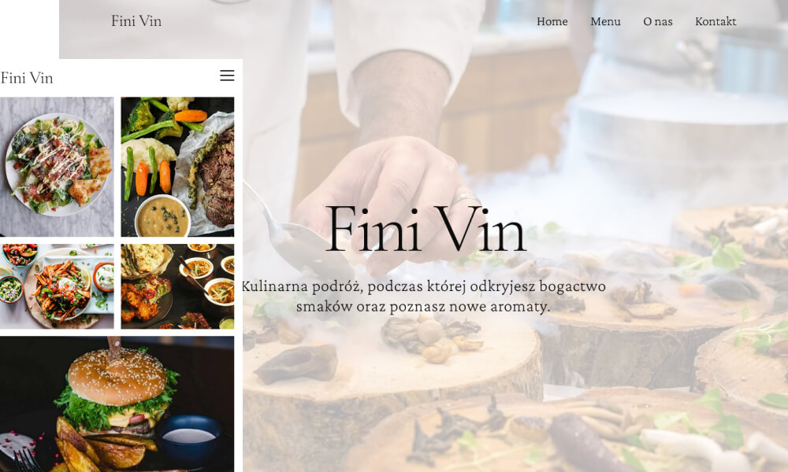

## FiniVin
**Restaurant website template**

HTML5 / CSS3 / TAILWIND

Website template for a restaurant, using a serif font. Multipage website with Lightbox with a photo gallery and Testimonial with opinions. There is also a contact form that will send a message to your email.

:poland:
Szablon strony dla restauracji, z użyciem czcionki szerofywej. Strona typu multipage na której zamieszczony jest Lightbox z galerią zdjęć oraz Testimonial z opiniami. Znajdziemy tu również formularz kontaktowy, który wyśle wiadomość na Twojego emaila.

### :star2: <a href="https://damiankoduje.pl/finivin/index.html">Demo</a>

### Credits:
- <a href="https://tailwindcss.com/">Tailwind</a>
- <a href="https://www.pexels.com">Pexels</a>
- <a href="https://fonts.google.com/specimen/Crimson+Pro">Crimson  Pro</a>
- <a href="https://fonts.google.com/specimen/Cormorant +Garamond">Cormorant Garamond</a>
- <a href="https://fonts.google.com/specimen/Inter">Inter</a>
- <a href="https://michalsnik.github.io/aos">AOS</a>
- <a href="https://biati-digital.github.io/glightbox">GLightbox</a>
- <a href="https://swiperjs.com/">Swiper</a>

### :slightly_smiling_face: Template created by [Damiankoduje.pl](https://damiankoduje.pl)